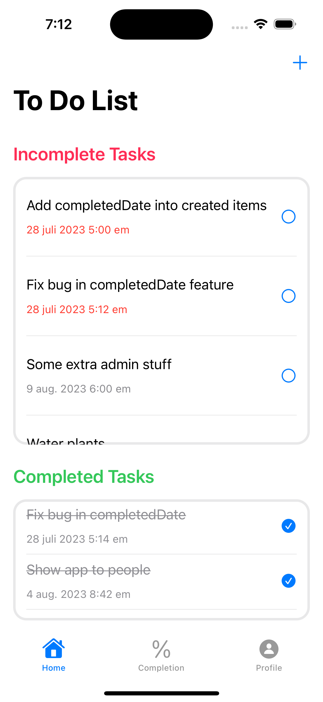
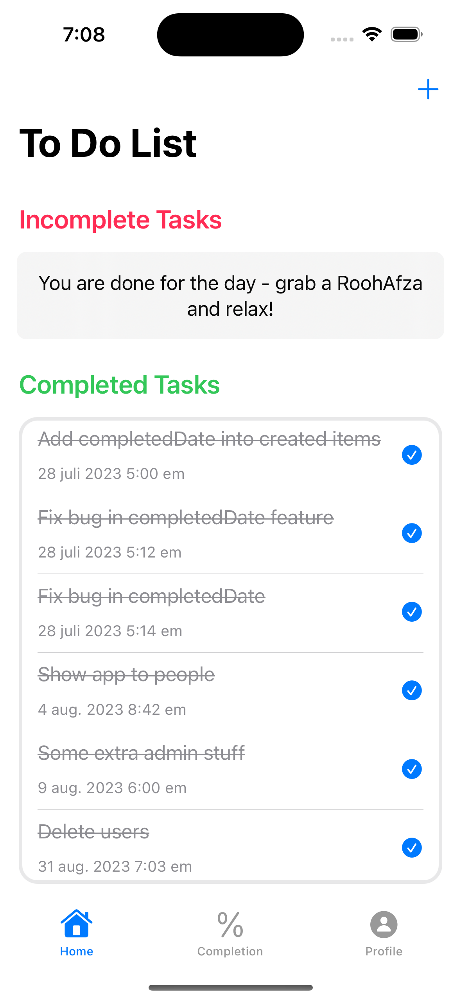

# ToDoList-SwiftUI
A To-Do list app made for iOS in Swift UI.

# Description
This is the first complete project in my journey of becoming a self-taught iOS app developer. This is a To-Do list app, which allows for the following functionalities:
- Register an account on the app
- Login with your account
- Add tasks to the list
- Mark tasks as complete or incomplete
- Get the following statistics: total tasks created, tasks completed, tasks completed on time
- See percentages of tasks completed, and tasks completed on time
- Log out

I used Firebase as the backend database for storing tasks and users data. The app was built using the iPhone 14 Pro as a simulator; I have not yet tested this on other devices.

# Features
I initially followed the following excellent set of tutorials provided at iOS Academy which can be found [here](https://www.youtube.com/playlist?list=PL5PR3UyfTWvei-pKlZN7d8r-0tHCK1EKE).

Afterwards, using this as a base, I majorly redesigned the interface, as well as added some features to the app. Here are some of the changes I made that were not in the original tutorial:
- Redesign the Tasks view to contain two separate sections for Complete and Incomplete tasks
- Sort the tasks by due date
- Move tasks from one list to the other upon change of status
- Make the Incomplete Tasks window resizable based upon number of items
- Add a Tasks Completion tab
- Compute and store basic statistics like total tasks created, tasks completed and tasks completed on time for each user
- Compute and display percentage of task completion and percentage of task completion on time for each user
- Redesign the profile view.

# In action
I consider it best to upload a bunch of screenshots to show the app's layout and working. 
   

<h3 align="center">Login and Register screens</h3>

  <kbd>
    
      
    <em>Login view</em>
  </kbd>
  
  <kbd>
    
      
    <em>Register view</em>
  </kbd>

  
<h3 align="center">Incomplete tasks screens</h3>

  <kbd>
    
      
    <em>Multiple incomplete tasks</em>
  </kbd>
  
  <kbd>
    
      
    <em>Three incomplete tasks</em>
  </kbd>
  
  <kbd>
    
      
    <em>Single incomplete view</em>
  </kbd> 

  
<h3 align="center">Completed tasks screen</h3>

  <kbd>
    
      
    <em>All tasks complete</em>
    </kbd>

  
<h3 align="center">Create task view</h3>

<kbd>
  
    
  <em>Create a new task</em>
</kbd>

  
<h3 align="center">Task Completion screen</h3>

  <kbd>
    
      
    <em>Task Completion statistics</em>
  </kbd>

  
<h3 align="center">User Profile view</h3>

  <kbd>
    
      
    <em>View profile</em>
  </kbd>

# Future work
There is plenty of work I would still like to do on the app. Here are some of the features I would like to add:
- Redesign the login and register views
- Better error handling - display to user what went wrong
- Create tabbed view for Complete and Incomplete tasks
- Allow user to edit a task
- Allow user to add details for tasks
- Allow users to set reminders for tasks

However, for now I am happy with the work that I have put into the app, and would like to continue my learning by building other apps. Maybe one day I come back to this!
